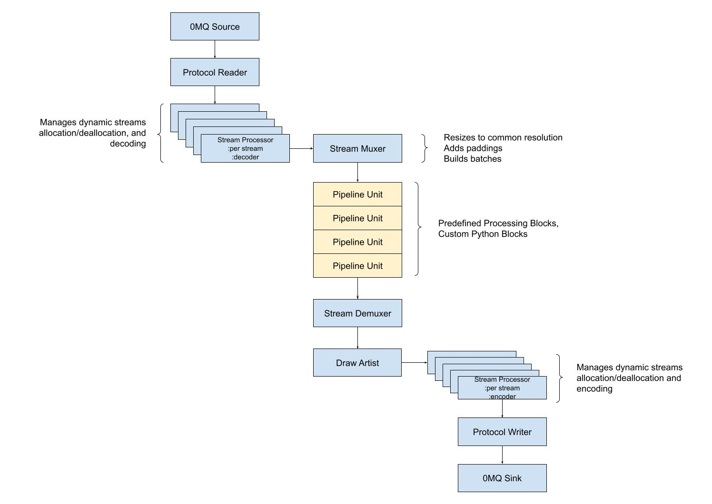

Module Overview
===============

A module is an executable unit that is deployed and executed on Nvidia edge devices or in the cloud on x86 servers with discrete GPUs. The module is defined in a YAML configuration file.

The module is responsible for managing every activity displayed in the following picture:

Module Runtime
--------------

Modules are executed within specially prepared docker containers. If a module does not require any additional dependencies, a base Savant docker image may be used to run it. Otherwise, a customized container must be built based on the selected base image. We provide base images for:

* Nvidia DGPUs on x86 architecture

   .. code-block:: bash

        docker pull ghcr.io/insight-platform/savant-deepstream:latest

* Deepstream 6.1+ capable Nvidia edge devices (Jetson Xavier/Orin)

   .. code-block:: bash

        docker pull ghcr.io/insight-platform/savant-deepstream-l4t:latest

The module utilizes the following directories:

* ``/models`` - where compiled models are located;
* ``/downloads`` - where the module downloads models from remote locations;
* ``/opt/savant`` - where the module expects the application code root is.

Normally, you map host's directories to the above-mentioned paths. You also can override ``/downloads`` and ``/models`` with the following parameters:

.. code-block:: yaml

  model_path: ${oc.env:MODEL_PATH, /models}
  download_path: ${oc.env:DOWNLOAD_PATH, /downloads}

Module Configuration
--------------------

Every module must have a ``name``, which is an arbitrary string, the ``pipeline`` block, and ``parameters``.

Parameters
^^^^^^^^^^

Any number of :py:attr:`~savant.config.schema.Module.parameters` can be set in the ``parameters`` section of the module configuration file, including user-defined ones.

If you need to define a per-stream configuration, consider using external configuration options like Etcd or a database like Redis or MongoDB. Another option could be passing the required instructions in the Savant protocol with frame tags enabling precise per-frame configuration.

The following parameters are defined for a Savant module by default:

.. literalinclude:: ../../../savant/config/default.yml
  :language: YAML
  :lines: 1-134

.. note::

  Any config values mentioning ``$``-based expressions (like ``${name}``) are substituted with the literal defined for the ``name``.

To access parameter values in runtime use the :py:class:`~savant.parameter_storage.param_storage` function:

.. code-block:: python

  from savant.parameter_storage import param_storage

  parameter_value = param_storage()['parameter_name']

Dynamic Parameters
^^^^^^^^^^^^^^^^^^

Savant supports module-wide dynamic parameters. Those parameters can retrieve their current values during the module execution. They are defined within the ``dynamic_parameters`` section. Currently, only Etcd is supported as a dynamic parameter source. The Etcd connection is configured with the ``parameters.etcd_config`` section.

The dynamic parameters are also available in the functions:

.. code-block:: python

  from savant.parameter_storage import param_storage

  parameter_value = param_storage()['some_dynamic_parameter_name']

Etcd must be configured with the ``parameters.etcd_config`` and ``parameters.dynamic_parameter_storage``:

.. code-block:: yaml

      # storages
      dynamic_parameter_storage: etcd
      etcd_config:
        endpoints:
          - host: etcd-server
            port: 2379
        timeout: 15

Parameter Initializing Priority
^^^^^^^^^^^^^^^^^^^^^^^^^^^^^^^

The section defines what parameter values source receives higher priority when resolving parameters. The lower number, the higher the priority:

.. code-block:: yaml

    parameter_init_priority:
        environment: 20
        etcd: 10

In the above case, environment variables have lesser priority than values fetched from the configured Etcd source.

Output Queue Max Size
^^^^^^^^^^^^^^^^^^^^^

The ``queue_maxsize`` parameter specifies the size of the buffer located at the end of the pipeline, right before the ZeroMQ sink. The parameter may be beneficial in cases when metadata payload metadata fluctuates between sequential frames in size significantly, causing temporary output delays. The buffer helps avoid blocking the pipeline while it has spare capacity. The default value is ``100``.

To configure the custom value, use:

.. code-block:: yaml

    parameters:
      queue_maxsize: 100

.. warning::

    Large values cause extra GPU/CPU memory usage.

.. _buffering_queues:

Buffering Queues
^^^^^^^^^^^^^^^^

The ``buffer_queues`` parameter is used to enable Python parallelization and enchance the performance in compute-intensive pipelines. By default, the parameter is disabled.

Read about the parameter in :doc:`/recipes/1_python_multithreading`.

Log Level
^^^^^^^^^

The ``log_level`` parameter defines the verbosity of logging for the framework. By default, it is configured as ``log_level: ${oc.env:LOGLEVEL, 'INFO'}`` which allows overriding it with the ``LOGLEVEL`` environment variable.

Output Video Stream Codec
^^^^^^^^^^^^^^^^^^^^^^^^^

If the ``output_frame`` section is set, Savant adds encoded video streams to sink. More information you will find in the next section :doc:`12_video_processing`.

OpenTelemetry Configuration
^^^^^^^^^^^^^^^^^^^^^^^^^^^

The ``telemetry`` section defines the telemetry configuration. The ``endpoint`` in ``telemetry.provider_params`` is required when ``telemetry.provider`` is set to ``'jaeger'``.

Example:

.. code-block:: yaml

    telemetry:
      sampling_period: 100
      append_frame_meta_to_span: false
      root_span_name: demo-pipeline-root
      provider: jaeger
      provider_params:
        service_name: demo-pipeline
        endpoint: jaeger:6831

Read more on OpenTelemetry in :doc:`/advanced_topics/9_open_telemetry`.

DevServer Configuration
^^^^^^^^^^^^^^^^^^^^^^^

DevServer is a special module execution mode enabling change detection in custom Python code and reloading those pieces automatically without the need for container restarts.

Read more on DevServer configuration in :doc:`/advanced_topics/9_dev_server`.

Pipeline Shutdown Authentication
^^^^^^^^^^^^^^^^^^^^^^^^^^^^^^^^

The ``shutdown_auth`` parameter defines a secret token which can be sent in the service shutdown message to terminate the pipeline. By default ``shutdown_auth`` is unset, and the pipeline ignores shutdown messages.

Currently, shutdown messages can be sent with :doc:`Client SDK </advanced_topics/10_client_sdk>`.

Pipeline
--------

The pipeline section is where the processing steps are defined. In the section, detectors, classifiers, segmenting units, and custom Python units are placed. They are described in detail in the following sections.
