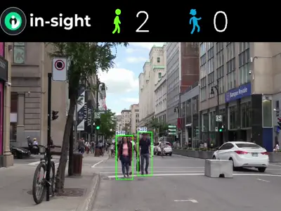

# Savant Demos, Samples and Education Materials

On this page, you can find practical examples, how-tos, publications, and other non-formal documentation links that can
help you dive into Savant.

- [ML/AI Examples](#mlai-examples)
- [Utility And Coding Examples](#utility-and-coding-examples)

## ML/AI Examples

To help novice users to dive into Savant, we have prepared several ready-to-use examples, which one can download, build
and launch. In addition, every sample includes all you need to run it: the source code, models, build file, sample data,
and a short README.md which covers the purpose and gives a brief explanation. Some samples are also accompanied by the
how-to guides published on the Medium portal, where one can study them step-by-step.

### People Detecting, Tracking and Anonymizing (Peoplenet, Nvidia Tracker, OpenCV-CUDA)

Sample Location: [peoplenet_detector](./peoplenet_detector)

Preview:

### Removing the background on a video frame using MOG2 from OpenCV CUDA

Sample Location: [peoplenet_detector](./opencv_cuda_bg_remover_mog2)

Preview:
